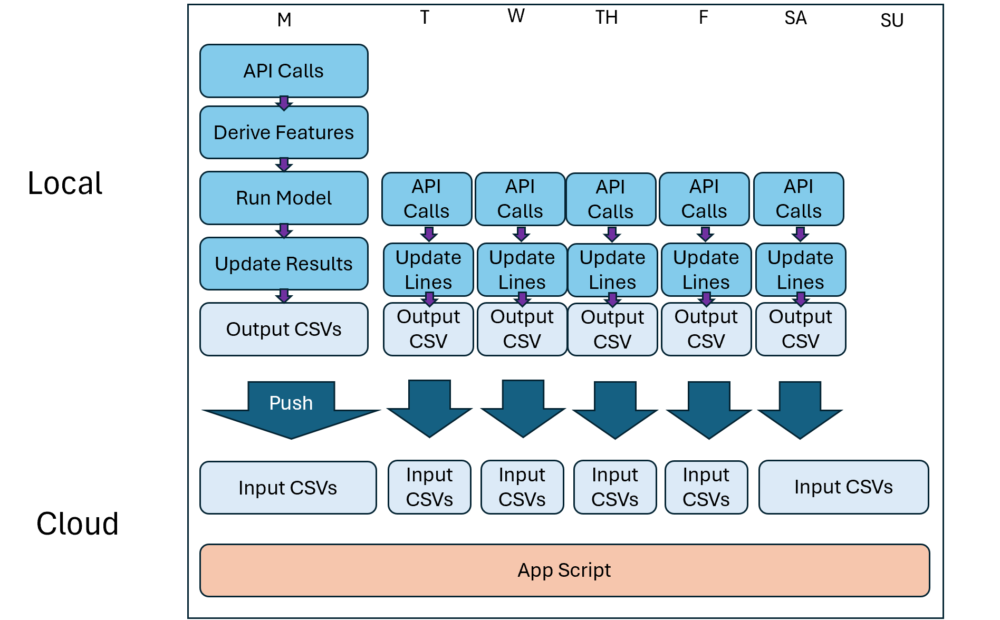

CFB Model README
================
2025-09-09

# Czar College Football

This document contains all documentation for Czar College Football,
including both the model and app. For any further questions, reach out
to Steve at <sczarnecki1212@gmail.com>

As for the code, only the app code is public. Model data preparation and
training are in a private repo.

 

## The Model

At a high level, this is a collection of three XGBoost models that
predict game outcomes. They all use the same features with different
outcome variables. They are as follows:

1.  Cover model: predict if a team will cover (0 or 1)
2.  Win model: predict if a team will win (0 or 1)
3.  Over model: predict if a game will hit the over (0 or 1)

Two different methods were tried: using linear predictions or binary.
For example, we could have predicted point differential for spread and
total points for over/under. However, after trying it both ways during
many different steps in the process, the binary classification model
always achieved better accuracy. So, we went with that for the final
model.

This model was built in R.

 

### The Rolling Window

The model itself is trained using a rolling window, as shown in the
diagram below. For each week, it trains on the last six years of data
and tests on the current week (e.g. trains on 2018 Week 7 through 2024
Week 5 to test on 2024 Week 6). For the next week, the training window
moves up one week and the test moves up to the next week. This dynamic
model architecture accounts concept drift in the game of football by
keeping the training data relatively recent. Also, this allows for every
single game to be used as test data so we can assess how well the model
works for everything possible.

Hyperparameter tuning was performed on data from 2015-2020, using a
slightly different architecture (for less compute time) and variable
selection is dynamically performed on training data each week by pulling
the top variables from a SHAP plot after an initial model is run.

Week 4 was chosen as the cutoff point since accuracy was bad for weeks 2
and 3 and improved for 4. This is likely because not much data is
available for the rolling windows to be computed.

 

### The Data

Data is pulled from the cfbfastR package, which uses College Football
Data API calls. The cfbd_game_info, load_cfb_pbp, cfbd_betting_lines,
cfbd_team_talent, and cfbd_rankings data sources are all used.

Book data is pulled from different providers. The package used to only
have smaller books but has added mainstream books over the last few
years. Today, Draft Kings and ESPN Bet are the books that are used, if
available.

Training data starts in 2015, resulting in four years of test data with
the six-year rolling window.

 

### Feature Engineering

Many features are derived using rolling windows. Once derived, they are
transformed into more complex features as well, which adjust for things
like strength of opponents. As a note, stats stop at Week 1 of the
current season, even if they do not cover the entire window (e.g. 3-week
rolling window stats computed for Week 3 just use weeks 1 and 2)

Here are some examples of derived features:

- Per-game stats: calculates per-game stats like off and def
  turnovers/game,off and def touchdowns/game, and off and defsacks/game
  over the last 1, 3, and 20 (season-long) games
- Per-play stats: calculates per-play stats like off and def EPA/play,
  off and def WPA/play, and off and def success rate over the last 1, 3,
  and 20 (season-long) games
- Grouped per-play stats: calculated per-play stats when filtered for
  certain groups. Includes off and def EPA/play on rushes and passes,
  off and def WPA/play on rushes and passes, and more over the last 1,
  3, and 20 (season-long) games
- Book lines: spread and over/under lines are used (from the most recent
  line before the game starts). Moneyline was not used because the data
  is more sparse with many nulls in older years, and the fact that it is
  similar to spread make it less meaningful.
- Talent ratings: pre-season ratings of how much recruiting talent is on
  the teams before the season starts (pulled from 247 Sports through
  cfbfastR)
- Rankings: tiers are derived based on where teams are ranked in the AP
  Poll
- Per-game overall metric stats: calculates per-game stats like win
  rate, points/game, and points against/game over the last 1, 3, and 20
  games.
- Opponent strength: opponent rank tiers and talent over the last 1, 3,
  and 20 games are calculates (e.g. if you just played Alabama, Georgia,
  and LSU, this will show that you played tough competition and likely
  be used to adjust for your other stats being lower in value but more
  impressive)
- Book error: how much the book was off when predicting a team’s games
  over the last 3 and 20 games
- Over average metrics: for many of these metrics, each week that went
  into them was looked at, computing an “over average” metric for each
  week instead of a raw metric. For example, if you scored 2 touchdowns
  against Alabama, but over the last 3 games they allowed an average of
  1 touchdown per game, you would be 1 touchdown over average. This
  would be donw for all 3 or 20 games within the window and the metric
  would be calculated based on these (e.g. 1 TD oa for Alabama, -2 TD oa
  for Georgia, and 0 TD oa for LSU would result in a metric of -.33 TD
  oa over the last 3 games). As a note, the opponent’s baseline was
  computed using the same time window as the stat, except for last game
  windows, which used the last 3 games. Also, If you played LSU in Week
  7, their baseline would be calculated based on weeks 4-6 and compared
  to your Week 7 stat when computing your metric that will be used for
  Week 8. Overall, these stats control for strength of opponents when
  looking at a team’s stats.
- Over time difference metrics: for certain metrics, different time
  periods were compared. For example, EPA/play over the last 3 games for
  a team would be compared to EPA/play over the last 20. This would show
  if the team is improving in that area or not.

NA’s are treated by looking back one to two weeks for each team to see
if any data can replace the current NA value as a proxy. If not, it is
left NA for XGBoost to handle.

Games are only predicted for FBS teams. They are not predicted for FCS
matchups, although stats from those games are used for future features
for the FBS teams.

 

### Results and Bootstrapping

As of the current backtesting on data from 2021-2024, the model is
significantly profitable for spread and moneyline. Non-parametric
bootstrapping is used to compute confidence intervals. Overall, the
cover model gives a return of +4.56% on betting the spread, the win
model a return of +9.46% on betting moneyline, and the over model a
return of -3.63% for betting over/under.

Take a look at the graphs for bootstrapping results. Overall, you can
see how as value improves (either cover probability over 50% or win
probability difference from vegas’s implied win probability), the
model’s return gets higher. Most of the returns at these higher levels
are significant as well.

One important note for the year to year models: spread has stayed stable
while moneyline return has decreased over the last couple years. Spread
is likely a safer bet as well as one with less variance. As a note on
the non-significance of these years, the sample sizes are too small.

 

### Data Leakage Prevention

Many precautions were taken to ensure that no data leakage occurred:

- Feature engineering was QA’ed to make sure all features came from
  previous week data. As an inherent verification, the data preparation
  structure in the current workflow computes the current (un-completed
  future) week’s features just as all the others. This means that there
  cannot possibly be leakage from after the game occurred if the game
  has not occurred yet.
- Variable selection occurs on the training data within the rolling
  window architecture. Each week, the initial model is computed using
  all 589 derived variables. From here, the SHAP feature importance plot
  is produced and the top 150 features are selected. This is all on
  training data, the test data being unseen.
- Hyperparameter tuning was performed on data from 2015-2020, which is
  included in training data at times but never in test data. So, test
  data is still completely unseen after tuning.
- Some features like vegas’s book spread or over/under line could be
  seen as proxies, but these are not threats to the integrity of the
  model. We are simply building the model around them. They are also
  available before the game at the time of prediction, being able to be
  used on real-life predictions as well.

 

### Potential Model Pitfalls

There are still a few reasons why the model may fall short of its
backtested accuracy in real life:

- Concept drift: although the rolling window tries to account for some
  of this issue, there is a chance the window will not account for some
  of the drift. We like 6 years to give enough training data, but the
  front end of that could be less representative of the current state of
  college football. Furthermore, features like vegas’s lines could
  change over time (i.e. their models change and now a 2018 book spread
  is completely different than a 2025). There is not much we can do on
  this point except keep trying different time windows.
- Overfitting: every precaution was taken against overfitting. We used
  cross-validation in hyperparameter tuning and tested on unseen data.
  We did not use the test data as validation data at all, just using it
  as a measure of accuracy. However, as in all models, there is a chance
  of overfitting.
- Dynamic model: while the rolling window is good to account for concept
  drift, the tradeoff is the fact that the model itself changes from
  week-to-week. While the models likely do not change much from week to
  week, the training does change and count bring accuracy in a bad
  direction. It is important to continue to monitor performance and
  consider switching model architecture and/or hyperparameters if
  real-life results start trending down.
- Betting data source changes: the data source that provides lines for
  the model has switched providers over the years. It used to not have
  major books and relied mostly on smaller books for lines, but not has
  sites like Draft Kings and ESPN Bet readily accessible. So, the
  betting line features change slightly over the years. However, these
  lines are usually the same or are only off by very small margins.

 

### Future Directions for the model

- Rolling window testing: perform more tests on the rolling window size.
  We did not want to do much, since we did not have that many years
  available and did not want to overfit by choosing a window based on
  performance that leaks into the test data (e.g. using 2015-2022 to
  test an eight-year rolling window, since it leaks into test data). It
  would be interesting to look into this as we progress through the
  years and have room to ethically test windows.
- Different model types: this model was started in XGBoost since it is
  one of the most powerful tree-based models out there, as well as one
  of the top models in general. However, it would be interesting to try
  other model types. Neural nets were considered, but 1) tree-based
  methods have been often shown to perform just as well and better on
  structured tasks and 2) there are likely too few rows (\<10,000) to
  train on for powerful neural network results. It would be interesting
  to try in the future though.
- Expand feature space: getting more features always shows to be the
  best way to improve models. Scraping more betting data like opening
  lines, % of money on each side, and more would be cool. Getting more
  CFB data in general would be cool. Also, using unstructured and even
  agentic methods would be interesting for feature inputs but would
  definitely need the use of a more neural network-centric approach.
- Weather data: weather data is available through cfbfastR after the
  game, but not before the game. It would be cool to find an API to
  predict weather and use for future predictions so the model can
  incorporate this data. In testing, some of this data added predictive
  value for over probability (good boost but still not profitable) while
  not adding much to cover or win probability predictions.

 

## The App

The app is built in the Streamlit package in Python for convenience. It
includes data that should be updated every week during the CFB season.

 

### Hosting

This web app is hosted using Streamlit Cloud. It is free and just
requires your app script to be in your GitHub repo. Data is stored
within csv files in this GitHub. They are relatively small files with
the larger upstream files being stored locally.

 

### Updating Data

The app updates early in the week each week (Monday or Tuesday, haven’t
decided yet). The model pipeline (different repo) is run to update data
and results up to this week. Some predictions and results are computed
in R, while others are left for inside the app. The output data is then
written to the local cfb_app_2 folder. From there, these outputs are
pushed to GitHub, automatically updating the app. There should be a
local job set up soon to run these prep files and push the outputs to
GitHub on a weekly schedule, but at the time of writing this in Week 3,
it is manual.

The only thing that changes within the week itself are betting lines.
There is another R script set up locally to run on a schedule (will
likely be automated to TH/F/SA mornings but is manual at the moment).
This will update the file containing betting lines and push to GitHub.

 

### This Week’s Picks

This page contains predictions for this week. It uses prepped training
data, this week’s trained version of the model, and this week’s selected
variables to compute predictions. The reason these predictions are
dynamic is so that when betting lines are updated, the predictions can
be easily updated in the app. These predictions rely on book lines to
base the predictions around, which is why this updating process is
necessary. It has been QA’ed to ensure that predictions made in the app
are the same as those made in R at the time of the week and after the
fact.

Looking at the filters, ‘Value’ is a way to sort our predicted best
value picks. Cover Value is a team’s Predicted Cover Probability minus
50% (50% is what we need to say that team will cover, so how much over
this threshold are we?). ML Value is the percentage difference between
our predicted win probability for the team with value and sportsbooks’
implied wp (converted from ML). Over/Under Value is also the game’s
Predicted Over Probability minus 50%.

 

### Betslip Builder

The point of this model is the fact that Expected Return % is positive.
We won’t win every game, but we should make money if we bet a portfolio
of games over time.

So, this is our way of building a portfolio, or bet slip in this case.
Users can add games to their betslip from here and see metrics like
expected return and variance. As a note, expected return is based on
conservative estimates. Historical backtesting suggests higher returns,
but we do not want to be too optimistic. These may be changed if profit
trends stay up.

You can choose to build your total portfolio value by assigning a dollar
amount to each unit bet or by defining an overall portfolio value to
divide evenly among units. Usually, the point is to bet a certain amount
and raise variance by splitting amongst more games, so we suggest this
route.

If you have trouble building your own betslip, you can use the
optimizer. This iterates through every game and picks the best game
until the constraints (min profit, max standard deviation, bet count)
are hit/violated. For example, if you select the min profit option, it
will keep adding bets until profit just reaches the defined threshold,
continuing to add variance up to that point. Max standard deviation will
keep adding games and lowering expected profit until we have gone under
the max stdev. The final option is randomness, which is the probability
that the bet selector will skip over a game during the loop. This adds
some randomness to each person’s betslip, and is recommended since the
mapping between confidence and profit isn’t completely linear.

 

### The Czar Poll

This one computes the win probability for if every team played every
team at home, away, and at a neutral site. The average win probability
is the team’s final power rating. Since betting lines are needed for the
win prob model itself, another model was built to predict these. Since
this was just for fun, not much time was spent on this shittier model,
but it was actually pretty accurate in predicting lines! As a note, if
games that are actually occuring this week use the actual lines, or
modified lines if they are happening but just at a different location.

 

### The Playoff

This one uses current AP Rankings to predict the CFB Playoff teams and
see who would win each game. These results are based on the same
theoretical results from the Czar Poll pipeline. You can override games
with the button at the bottom. Once again, just for fun.

 

### Game Predictor

This one predicts any theoretical game that could happen at any
location. Once again, just for fun.

 

### Betting Accuracy

This page shows historical accuracy from Weeks 4-National Championship
from 2021-24. This will update each week with last week’s results. You
can apply many filters to see how the model performs in certain
situations. Returns are based on if you split \$100 evenly among all the
games currently being analyzed after filters. The actual historical
results dataset was included for transparency. As a note, a few rows may
be missing moneyline data, but this number is very small and from older
years.

 

## That’s It

That’s all. Go Irish.

 
